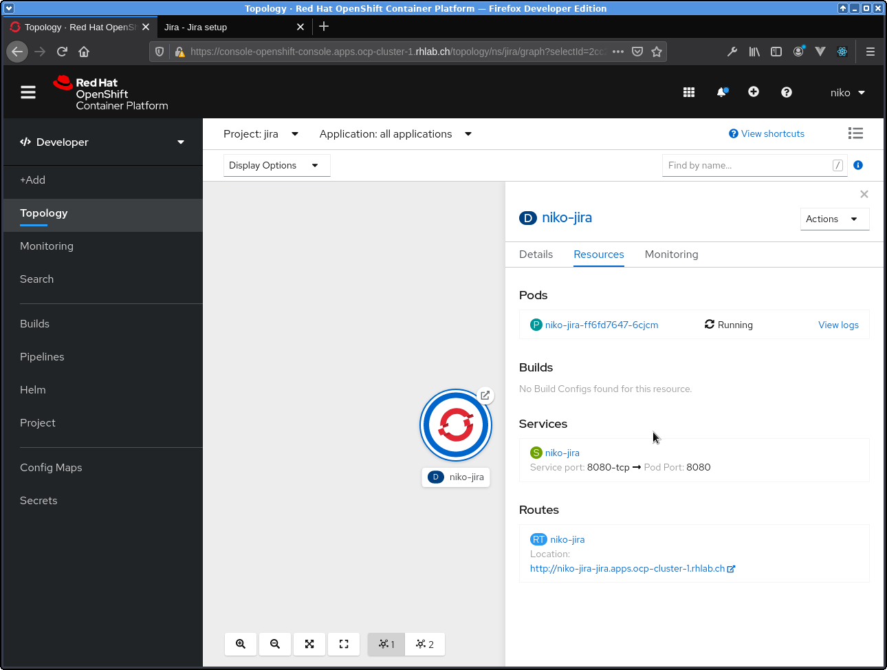
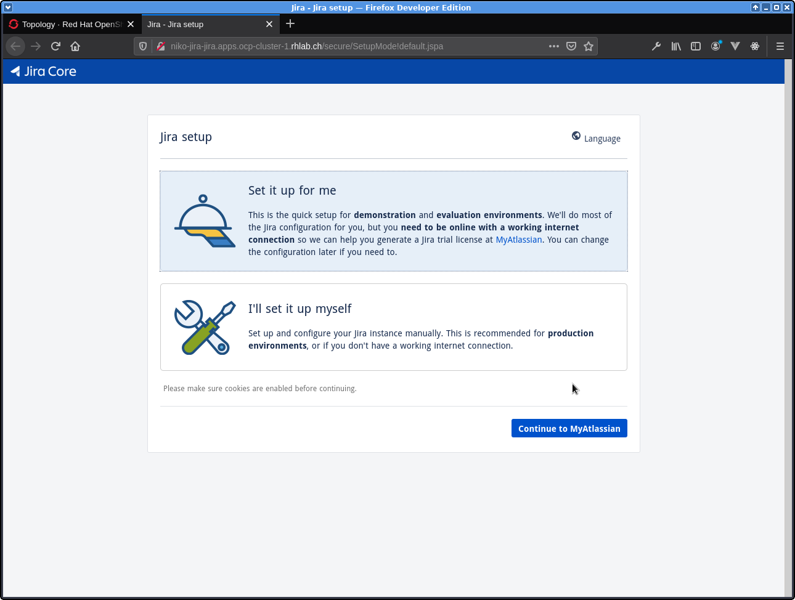

# Jira as  container on OpenShift 4.x

My custom image

Install jira on VM with installer as described here:

https://confluence.atlassian.com/adminjiraserver/installing-jira-applications-on-linux-938846841.html

I installed using user jira on my vm.

After installation zip installed content in file:

    atlassian-installed.zip

and place it the directory close to Dockerfile

build Docker container with script:

	 build-docker-local.sh

I used podman but you can use docker daemon as well

## Deploy on OpenShift

        oc new-project jira

        # set registry endpoint
        export REGISTRY_URL=default-route-openshift-image-registry.apps.ocp-cluster-1.rhlab.ch

        # login to registry first
        podman login -u $(oc whoami) -p $(oc whoami -t) $REGISTRY_URL --tls-verify=false

        # push your container to internal registry

        podman push --tls-verify=false $REGISTRY_URL/jira/niko-jira:latest

We are going to add a security constraint (or rather we are going to
relax a default setting which would normally prohibit containers running as root):

        oc adm policy add-scc-to-user anyuid -z default

And finally deploy application:

        oc new-app niko-jira

        oc expose service niko-jira

useful link:

https://www.openshift.com/blog/getting-any-docker-image-running-in-your-own-openshift-cluster
